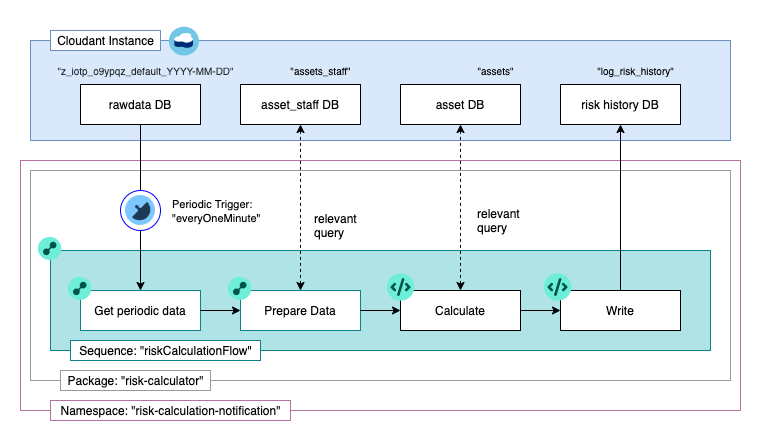

# Risk Calculator

This repository consits of functions related to risk-calculator. Its task is to periodically read data a from cloudant (raw sensor data), cleans and normalise the data for calculation and gives current risk-data (ANSHIN-index) as [output](./runtimes/package_output.eslintrc).

This sequence comprises of smaller sequences, actions and some default [openwhisk-cloudant actions](https://github.com/ibm-functions/package-cloudant/tree/master/packages/database-actions).

[](/images/risk-calculator.pdf)

## Implementation steps
*Pre-requisite*:

- Install [IBM cloud CLI](https://cloud.ibm.com/docs/openwhisk?topic=openwhisk-cli_install)
- [Setting up](https://cloud.ibm.com/docs/cli?topic=cli-getting-started) CLI environment.
- [Create cloudant instance](https://cloud.ibm.com/docs/Cloudant?topic=Cloudant-getting-started-with-cloudant)


Steps to implement risk-calulator are mentioned as follows:

- target/create namespace
- create required cloudant-bindings
- deploying the risk-calculator actions, sequences and trigger

## Target namespace

To us IBM Cloud functions, create or target a namespace. In this sample the namespace name is <code>risk-calculation-notification</code>.

- List namespaces to check your namespace exists

    ```sh
    ibmcloud fn namespace list
    ```

  - if the namespace doesnot exist, create a namespace

    ```sh
    ibmcloud fn namespace create <namespace_name> [--description <"description of your namespace">]
    ```

    Sample

    ```sh
    ibmcloud fn namespace create risk-calculation-notification --description "This namespace contains IBM cloud functions related to risk calculation and storage in risk-history DB"
    ```
  
  - Verify namespace creation

    ```sh
    ibmcloud fn namespace get <namespace_name_or_id> --properties
    ```

    Sample

    ```sh
    ibmcloud fn namespace get risk-calculation-notification --properties
    ```

- Target namespace

    ```sh
    ibmcloud fn namespace target <namespace_name_or_id>
    ```

    Sample

    ```sh
    ibmcloud fn namespace target risk-calculation-notification
    ```

## Binding the /whisk.system/cloudant package to your IBM Cloudant database
[see source for details](https://cloud.ibm.com/docs/openwhisk?topic=openwhisk-pkg_cloudant)

- Create a /whisk.system/cloudant package binding that is configured for your IBM Cloudant account and verify it. In this example, the package name is <code>myCloudant</code>.

    ```sh
    ibmcloud fn package bind /whisk.system/cloudant myCloudant

    ibmcloud fn package list
    ```

    **Example output**

    packages
    /< ...namespace ....>/myCloudant private


- Get the  service instance to bind to an action or package. If you don't see, create one.

    ```sh
    ibmcloud resource service-instances
    ```

    **Example output**

    ```sh
    Name          Location   State    Type
    cloudant-dev   jp-tok   active   service_instance
    ```

- Get the credentials for your cloudant-service instance.

    ```sh
    ibmcloud resource service-keys --instance-name cloudant-dev
    ```

    **Example output**

    Name                        State    Created At 
    ServiceCredential_Writer    active   Thu Jun  4 08:37:15 UTC 2020
    cloudant-key-writer         active   Wed Jul 22 02:32:19 UTC 2020
    cloudant-key-reader         active   Wed Jul 22 02:32:25 UTC 2020

- Bind the service to your created package <code> myCloudant </code>, and very a successful bound.

    ```sh
    ibmcloud fn service bind cloudantnosqldb myCloudant --instance cloudant-dev --keyname 'ServiceCredential_Writer'

    ibmcloud fn package get myCloudant parameters
    ```

## Deploying the Risk Calculator package

- Clone the Risk-Calculator template repo.

    ```sh
    git clone https://github.com/Hitachi-CTI-Call-For-Code-COVID-19-Team/risk-calculator.git
    ```

    **REQUIRED SETTING:**

  - Set Cloudant credentials: input credentials [here](/runtimes/actions/riskCalculationFlow/calculator.py) and [here](/runtimes/actions/riskCalculationFlow/prepareDataForCalculation/queryRelevantStaff.py).
  you can gets cloudant credentials from  [delivery repo](https://github.com/Hitachi-CTI-Call-For-Code-COVID-19-Team/delivery.git) <code>(delivery/scripts/.credentials)</code> or as obtained in above (Cloudant-binding) steps.

- Deploy the template

    You must include a package name to contain your action. Replace <name> with a custom name for your package. In this sample, package name is <code> risk-calculator </code>

    ```sh
    PACKAGE_NAME=<name> ibmcloud fn deploy -m manifest.yaml
    ```

    Sample

    ```sh
    PACKAGE_NAME= risk-calculator ibmcloud fn deploy -m manifest.yaml
    ```

After the template deploys, you can make further edits to the code to customize it as needed, or go back and check out the catalog of available templates.

## Creating actions from the CLI

- Creating actions.

    ```sh
    ibmcloud fn action create <action_name> <file> --kind <runtime>
    ```

    Samples

    ```sh
    cd risk-calculator/runtimes/actions/riskCalculationFlow/

    ibmcloud fn action create risk-calculator/getTodaysSensorDBName periodicDataQuery/getTodaysSensorDBName.py --kind python:3.7

    ibmcloud fn action create risk-calculator/createQuerySelector periodicDataQuery/createQuerySelector.js --kind nodejs:10

    ibmcloud fn action create risk-calculator/checkQueryValidity periodicDataQuery/checkQueryValidity.py --kind python:3.7

    ibmcloud fn action create risk-calculator/normaliseDataPerQueryInterval prepareDataForCalculation/normaliseDataPerQueryInterval.py --kind python:3.7

    ibmcloud fn action create risk-calculator/queryRelevantStaff prepareDataForCalculation/queryRelevantStaff.py --kind python:3.7

    ibmcloud fn action create risk-calculator/calculator calculator.py --kind python:3.7

    ibmcloud fn action create risk_calculator/formatData_BulkWrite formatData_BulkWrite.py --kind python:3.7
    ```

- Verify that the actions are in your actions list.

    ```sh
    ibmcloud fn action list
    ```

## Creating a sequence from the CLI

- Create a sequence created actions (here, the directory name represents sequence names).

    ```sh
    ibmcloud fn action create <sequence_name> --sequence <action_1>,<action_2>
    ```

    Sample: 
    
    This sample Create sthree sequences named: <code> periodicDataQuery, prepareDataForCalculation, riskCalculationFlow </code>.
    - Uses Cloudant-package functions named <code> exec-query-find </code> and <code> manage-bulk-documents </code>.

    ```sh
    ibmcloud fn action create periodicDataQuery --sequence getTodaysSensorDBName,createQuerySelector,/_/myCloudant/exec-query-find,checkQueryValidity

    ibmcloud fn action create prepareDataForCalculation --sequence normaliseDataPerQueryInterval,queryRelevantStaff

    ibmcloud fn action create risk-calculator/riskCalculationFlow --sequence periodicDataQuery,prepareDataForCalculation,risk_calculator/calculator,risk_calculator/formatData_BulkWrite,/_/myCloudant/manage-bulk-documents
    ```

## Creating triggers from the CLI

- Create the trigger. Triggers must be created directly within a namespace and can't be created inside packages. In this case, we create a periodic trigger.

    ```sh
    ibmcloud fn trigger create TRIGGER_NAME
    ```

    Sample: 

    Trigger for ONE minute, you can change [cron expression](https://en.wikipedia.org/wiki/Cron) in <code> cron "* * * * *" </code> to change the interval

    ```sh
    ibmcloud fn trigger create periodicOneMinute --feed /whisk.system/alarms/alarm -p cron "* * * * *" -p trigger_payload "{}"
    ```

    **Example output**

    ```sh
    ok: created trigger periodicOneMinute
    ```

- Verify that the trigger is created.

    ```sh
    ibmcloud fn trigger list
    ```

    **Example output**

    ```sh
    triggers
    /NAMESPACE/periodicOneMinute                            private
    ```

Next, you can test the trigger or create a rule to associate the trigger with an action.

- Set rule to conect trigger to sequence


    Create a rule that invokes the risk-calculation sequence every time the everyOneMinute trigger gets fired.

    ```sh
    ibmcloud fn rule create ruleRC everyOneMinute risk_calculator/riskCalculationFlow
    ```

    **Example output**

    ok: created rule ruleRC

- Check that the action is being invoked by polling for activation logs.

    ```sh
    ibmcloud fn activation poll
    ```

You can see that the activations occur every minute for the trigger, the rule, and the action.

## Related
- [Edge Data collector](https://github.com/Hitachi-CTI-Call-For-Code-COVID-19-Team/edge-data-collector.git)
- [Risk Notifier](https://github.com/Hitachi-CTI-Call-For-Code-COVID-19-Team/risk-notifier.git)
- [Push Notification](https://github.com/Hitachi-CTI-Call-For-Code-COVID-19-Team/push-notifications.git)

-------------

#### [Licence](LICENSE.txt)


