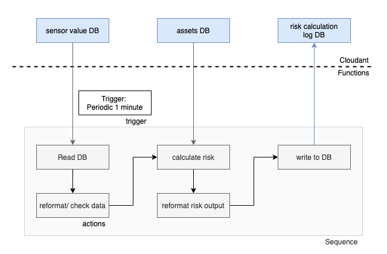

## Risk Calculator flow



The flow in Risk Calculator is done in three parts:

### 1. Get sensor data
1. When a new data is entered in the sensor_DB, an *event* is triggered. 
2. This TRIGGER runs the *action* to read the Data in raw format.
    - Here format is:       [Timestamp, SensorID, Sensor Values]
3. This action also formats the data (json format) to python dataframe format for calulations purposes.
    - Here formatting is:   [Timestamp, Sensor 1 value, Sensor 2 values, ...., Sensor X value]
4. Reformat this  dataframe to json format for funtion-return.

### 2. Calculate risk
1. Define the threshold values (low, medium, high, very hig) for each sensor and stor it in a dictionary.
2. Convert read_sensor_data to dataframe and rescale the timestamp to 1 minute duration (allows 60 second buffer between each calcualtion)
3. Match the sensor data values with threshold and classify type/level of risk.
4. Store the corresponding risk levels along with the type of sensor/area and timestamp.
5. Convert the dataframe to *json format* for function return.

### 3. Write Risk to BD
1. Reformat the json of risk data.
2. write it to *risk-history-log* database


Here's the json format for storing the risk calculation data in DB.

```json

[
  {
    "_id": "a2e194048cd42a5d87dcccaa82f26f7c",
    "_rev": "1-8874e7a197d7c2841e1cb1664c572c6a",
    "congestion": 1,
    "cummulativeRiskValue": 2,
    "disinfection": 0,
    "id": "area_people_counter-xxx-xxx",
    "level": "high",
    "riskvalue": 2,
    "sanitisation": 0,
    "timestamp": "2020-06-04T13:50:40+09:00",
  }
]

